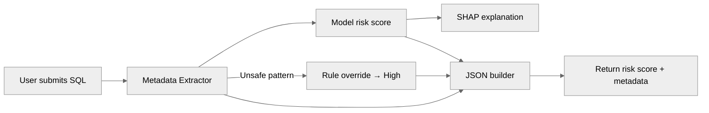
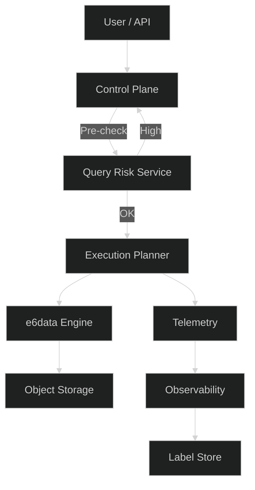

# Query Risk Scoring – PoC

This is a simple, self-contained proof of concept that scores incoming SQL queries for risk before they ever touch a compute engine. The goal: catch expensive or unsafe patterns early and give the platform a way to avoid accidental over-consumption, fan-outs, bad joins and unnecessary cluster pressure.

The system runs locally but mirrors how a production control plane hook would work inside e6data.

---

## What this PoC actually does

A SQL query goes through three steps:

1. **Metadata extraction**
   The script breaks down the query into structural features: table counts, joins, subqueries, SELECT *, estimated table sizes, join fan-out, sort cost, filters, window functions, cartesian joins, etc.

2. **Risk scoring**
   An XGBoost model trained on synthetic_v3.csv outputs low / medium / high risk.
   Accuracy is ~89% on the held-out set. SHAP is integrated for transparency.

3. **Rule overrides**
   Some patterns are so clearly unsafe that ML is skipped:

   * ON 1=1 / CROSS JOIN → forced high
   * SELECT * on a table > 20M rows → forced high
   * Other pathological expansions

This mix gives nuance when needed (ML) and guarantees safety when required (rules).

---

## Why this is useful to an engine like e6data

* Protects the cluster from accidental high-cost queries
* Gives the gateway a fast, cheap pre-execution hook
* Sets the stage for auto-tuning: slot sizing, spill prevention, adaptive parallelism
* Integrates naturally into observability and telemetry
* Helps enforce safety and governance without blocking legitimate workloads

The whole thing runs in milliseconds and can scale linearly as a microservice.

---

## Quick flow (how a query moves through the system)



---

## How this fits around an execution engine (conceptual)



---

## How to run it

Install deps:

```
pip install -r requirements.txt
```

Single query:

```
python infer.py "SELECT * FROM users"
```

Batch:

```
python batch_infer.py test_queries.txt
```

UI demo:

```
streamlit run app_streamlit.py
```

---

## File layout

```
infer.py
batch_infer.py
app_streamlit.py
metadata_extractor.py
train_model.py
synthetic_generator.py
tables_config.py
synthetic.csv
synthetic_v3.csv
test_queries.txt
requirements.txt
xgb_query_risk.joblib
```

---
